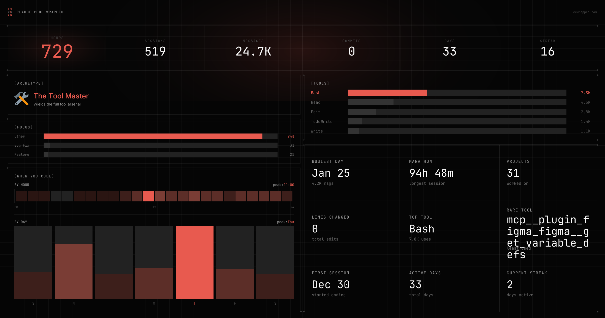

# ccwrapped

Your year in code, visualized. A Spotify Wrapped-style experience for Claude Code users.

[](LICENSE)
[](https://github.com/jarrodwatts/ccwrapped/stargazers)



## Install

Inside a Claude Code instance, run the following commands:

**Step 1: Add the marketplace**
```
/plugin marketplace add jarrodwatts/ccwrapped
```

**Step 2: Install the plugin**
```
/plugin install ccwrapped
```

**Step 3: Generate your wrapped**
```
/wrapped
```

Done! Your personalized wrapped page opens automatically.

---

## What is Claude Code Wrapped?

Claude Code Wrapped analyzes your local session data and generates a shareable visualization of your coding stats, patterns, and personality archetype.

| What You Get | What It Shows |
|--------------|---------------|
| **Stats overview** | Sessions, messages, hours, commits, lines changed |
| **Tool usage** | Which tools you use most (Read, Edit, Bash, etc.) |
| **Time patterns** | When you code - peak hours, busiest days |
| **Coding archetype** | Your personality type based on usage patterns |
| **Highlights** | Streaks, busiest day, longest session |

### The 12 Archetypes

| Archetype | Description |
|-----------|-------------|
| Night Owl | Burns the midnight oil |
| Marathoner | Long, focused sessions |
| Sprinter | Quick, efficient bursts |
| Bug Hunter | Finds and fixes issues |
| Builder | Creates new features |
| Tool Master | Uses the full toolkit |
| Delegator | Leverages agents effectively |
| Streak Master | Consistent daily coding |
| Polyglot | Works across many projects |
| Deep Diver | Thorough, methodical work |
| Explorer | Investigates and discovers |
| Pair Programmer | High-volume collaboration |

---

## Privacy

**Only aggregate stats are shared:**
- Session counts, message counts, hours spent
- Tool usage counts
- Time patterns (hours/days)
- Streaks and highlight dates

**Never shared:**
- Your actual code
- Prompts or conversations
- File paths or project names
- Any content from your sessions

Your wrapped page is shareable - it contains only anonymous statistics.

---

## Tech Stack

The web app at [ccwrapped.com](https://ccwrapped.com) is built with:

- **Framework:** Next.js 16 with App Router
- **UI:** React 19, Tailwind CSS v4, Radix UI
- **Animation:** Motion library
- **Storage:** Vercel KV
- **Image Generation:** Sharp for OG images

---

## Development

```bash
# Install dependencies
bun install

# Run dev server
bun dev

# Build for production
bun run build
```

---

## License

MIT - see [LICENSE](LICENSE)

---

<p align="center">
  <sub>Not affiliated with Anthropic</sub>
</p>
